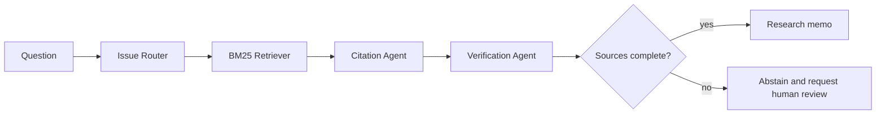

# Prosecution Legal RAG

A citation-first legal research workflow that demonstrates retrieval, grounded drafting,
source verification, uncertainty handling, and mandatory human review.

> Portfolio reconstruction by **SunZhengjun**. The bundled provisions and questions are entirely
> fictional. This repository contains no case material, personal information, source code, or
> internal knowledge from any procuratorate, employer, or client.



## Highlights

- Small but complete BM25 implementation with no external services
- Every statement carries a resolvable provision identifier
- Verification checks citation coverage, source, and effective date
- Abstains when evidence is absent instead of fabricating a legal conclusion
- Chinese demonstration content, automated tests, and GitHub Actions
- Provider-neutral design ready for dense retrieval, reranking, graphs, and local LLMs

## Run

```bash
python -m venv .venv
# Windows: .venv\Scripts\activate
pip install -e ".[dev]"
legal-rag-demo "自动化建议为什么需要保留依据和人工复核？"
pytest -q
```

## Production evolution

A production-grade version would ingest only approved public sources, retain immutable source
snapshots, use article-aware chunking, combine BM25 and dense retrieval with reciprocal-rank
fusion, add a reranker, enforce matter-level access control, redact personal information, and
evaluate retrieval recall separately from answer faithfulness.

## Responsible-use position

This project supports research, not automated adjudication. A model must not replace a legal
professional, infer guilt, or process real case files without a lawful basis, strict access
controls, audit trails, and organizational approval.

## Prior art

The design is informed by public ideas in
[Legal-RAG](https://github.com/Fan-Luo/Legal-RAG) and
[LegalGraphRAG](https://github.com/XMUDeepLIT/LegalGraphRAG). This is an independent implementation;
no third-party code or datasets are included.

## License

MIT
